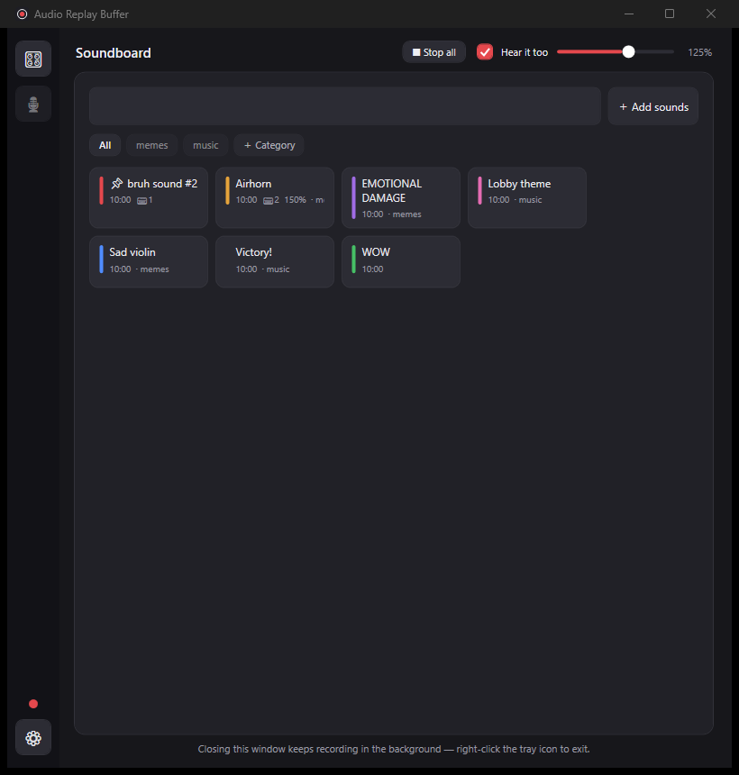

> [!WARNING]
> **This project was fully written by AI** (Claude, by Anthropic). It may contain bugs or unexpected behavior. Use it at your own risk — **we are not responsible** for any problems, data loss, or damage resulting from its use.

# 🔴 Audio Replay Buffer

**A soundboard that records its own material.** Two tools in one Windows app:

- 🎛 A **soundboard** — a pad grid of sounds you fire into your Discord/voice call with a click or a global hotkey, organized into categories, with per-sound colors and volumes.
- 🎙 An **audio replay buffer** — like OBS Replay Buffer but audio-only: the last minutes of your PC's sound are always in RAM, and one hotkey saves the moment as an MP3. Trim it in the built-in editor, and it becomes your next soundboard pad.

Someone said something legendary in the call? `Ctrl+Alt+D` clips it, trim it in two drags, drop it on the board — and replay it at them forever. All at ~0% CPU while idle.



## Features

**Soundboard**
- Pad grid with its own library — **drag & drop MP3/WAV files** to import, or promote replays with one click
- **Categories** (chips above the grid, folder-backed) — drag pads onto chips to move sounds, Ctrl+drag to copy, drop Explorer files on a chip to import straight into it
- Per-sound **volume** (10–300%), **pad colors**, **pin to top**, labels independent of file names
- **Global hotkeys**: bind sounds to `Ctrl+Alt+1`–`9`, stop everything with `Ctrl+Alt+0` or the **Stop all** button
- **Quick launcher** — `Ctrl+Alt+Q` anywhere (even mid-game): type two letters, Enter, the sound plays into your call
- **Overlap or interrupt** mode: layer sounds over each other, or let each new sound cut the previous one

**Replay buffer**
- Rolling in-RAM buffer (1–30 min): nothing written to disk until you save; `Ctrl+Alt+S` saves everything, `Ctrl+Alt+D` the last 30 s (all configurable)
- Capture the **whole desktop**, **one specific app** (just the game, just Discord), everything **except** one app, or the **microphone** — with live level meter and waveform
- Explicit **Start/Stop** control; always launches recording
- Recent replays list with durations: play to mic, edit, rename, delete (to Recycle Bin)

**Editor**
- Two **range handles** under the waveform — saving exports exactly the enclosed range, so trimming is drag → Save as copy
- Cut sections, fade in/out, volume, normalize, undo; preview with a live playhead
- Safe overwrite (encodes to a temp file first — a failed save can never destroy the original)

**App**
- Dark UI with an icon rail switching between full-window Soundboard and Replay modes
- Closes to the system tray and keeps recording; optional start with Windows (hidden)
- Settings live in `%AppData%\AudioReplayBuffer` and **survive updates**; built-in **update checker**
- Crash-resilient: unexpected errors are logged (`log.txt`) and the app keeps recording

## Requirements

- **Windows 10 (version 2004+) or Windows 11** (per-app capture needs 2004+)
- **For "play into the call":** a virtual audio cable — [VB-CABLE](https://vb-audio.com/Cable/) (free) or [Voicemod](https://www.voicemod.net/). Not needed for recording or local playback.
- MP3 encoding uses Windows' built-in Media Foundation; [ffmpeg](https://ffmpeg.org/) is an automatic fallback if present.
- The installer and portable zip are **self-contained** — no .NET installation needed. Building from source needs the [.NET 10 SDK](https://dotnet.microsoft.com/download/dotnet/10.0).

## Installation

**Easiest:** download **`AudioReplayBuffer-Setup-x.x.x.exe`** from the **[Releases page](https://github.com/TareqAli-CS/AudioReplayBuffer/releases)** and run it — per-user install, no admin rights, Start Menu shortcut, clean uninstaller. A **portable zip** (unzip & run) is also there. The app checks for new releases on startup and via tray → *Check for updates*.

> Windows SmartScreen may warn about the unsigned exe — click *More info → Run anyway*.

**From source:**

```powershell
git clone https://github.com/TareqAli-CS/AudioReplayBuffer.git
cd AudioReplayBuffer
dotnet publish AudioReplayBuffer -c Release -r win-x64 --self-contained true -o publish
publish\AudioReplayBuffer.exe
```

The installer itself is built from [installer/AudioReplayBuffer.iss](installer/AudioReplayBuffer.iss) with [Inno Setup](https://jrsoftware.org/isinfo.php).

## Quick Start

1. **Run the app** — it opens on the soundboard and immediately starts buffering desktop audio (red dot in the rail = recording).
2. **Set up the call output once:** ⚙ Settings → *Play to mic* → pick your virtual cable device (see below).
3. **Add sounds:** drag MP3/WAV files onto the board, or clip a live moment with `Ctrl+Alt+D` and use *Send to soundboard*.
4. **Click a pad** — your friends hear it. `Ctrl+Alt+Q` mid-game does the same without leaving your game.

## Connecting It to Discord (or any call app)

Windows doesn't let apps inject audio into a physical microphone, so every soundboard works through a **virtual audio device**:

1. Install [VB-CABLE](https://vb-audio.com/Cable/), or use Voicemod's virtual device if you have it.
2. In **⚙ Settings → Play to mic**, pick the cable's *playback* side (e.g. `CABLE Input (VB-Audio Virtual Cable)` or `Line (Voicemod Virtual Audio Device)`).
3. In Discord, set the **input device** to the cable's *microphone* side (e.g. `CABLE Output`). **Voicemod users:** keep Discord on the Voicemod mic — your voice and the sounds get mixed automatically.

**Hearing an echo?** Untick *"Hear it too"* — the echo is the sound playing on your speakers and being picked up again by your real mic (or doubled by Voicemod's own monitoring).

## Using the Soundboard

- **Play:** click a pad (green border = playing; click again stops it). *Stop all* or `Ctrl+Alt+0` silences everything instantly.
- **Organize:** ＋ Category creates a category (a subfolder of the library — everything stays visible in Explorer). Drag pads onto chips to move sounds (**Ctrl+drag copies**), or right-click → *Move / copy to category…*.
- **Customize:** right-click → *Rename / hotkey / volume…* for the label, file name, **pad color**, per-sound volume, category, and `Ctrl+Alt+1..9` hotkey slot. *Pin / unpin* keeps favorites at the top.
- **Reorder:** drag a pad **onto another pad** to place it before it, or onto empty grid space to send it to the end — the order is remembered.
- **Edit:** right-click → *Edit sound…* opens the full editor; saved copies appear on the board immediately.
- **Find:** the search box filters pads as you type; `Ctrl+Alt+Q` opens the global launcher with the same search.

## The Replay Buffer

Switch to 🎙 in the rail for the recorder: live level meter, buffer fill, waveform of the buffered audio, **■ Stop / ▶ Start** control, and the recent replays list (double-click a replay to fire it into the call, right-click for everything else). The buffer keeps only the last N minutes in RAM and writes nothing until you save — silence stays accurate, device switches (plugging in headphones) are handled, and the app always launches recording.

**Capture sources** (⚙ Settings → Capture): entire desktop, microphone only, both mixed — or a **single app** picked from the apps currently playing audio (also invertible: everything *except* that app). Per-app capture means your music never ends up in the clip.

## Default Hotkeys

| Hotkey | Action |
|---|---|
| `Ctrl+Alt+S` | Save the whole buffer as MP3 |
| `Ctrl+Alt+D` | Save the last 30 seconds |
| `Ctrl+Alt+1`–`9` | Play soundboard slot into the call |
| `Ctrl+Alt+0` | Stop all soundboard playback |
| `Ctrl+Alt+Q` | Quick launcher (search & play any sound) |

All configurable in ⚙ Settings.

## Configuration

Settings are edited in the ⚙ Settings window and stored in `%AppData%\AudioReplayBuffer\appsettings.json` (labels, hotkey slots, colors, and pins live in `soundboard.json` next to it — everything survives updates):

| Setting | Default | Meaning |
|---|---|---|
| `CaptureMode` / `TargetApp` / `TargetAppExclude` | `Desktop` / — / `false` | What the buffer records |
| `BufferMinutes` / `Bitrate` | `5` / `192` | Buffer length (≈11 MB RAM per minute) and MP3 quality |
| `Hotkey` / `ClipHotkey` / `ClipSeconds` / `LauncherHotkey` | see table above | Hotkeys |
| `OutputFolder` | `Music\Replays` | Replays folder; the soundboard library is its `Soundboard` subfolder |
| `VoiceDevice` / `VoiceVolume` / `VoiceAlsoSpeakers` | — / `100` / `true` | Call output device, master volume, self-monitor |
| `SoundboardOverlap` | `false` | Sounds layer over each other instead of cutting |
| `DesktopGain` / `MicrophoneGain` | `1.0` | Capture volume per source |

## Troubleshooting

- **"Hotkey is already in use"** — another app owns that combo; change it in Settings.
- **Friends can't hear sounds** — Discord's input must be the *cable's microphone* side (step 3 above).
- **Per-app capture says the app is not running** — start the target app first, or switch back to *All apps*.
- **Echo in the call** — untick *"Hear it too"*, or use headphones.
- Errors are logged to `%AppData%\AudioReplayBuffer\log.txt`; unexpected errors won't kill the app.

## Tech Notes

C# / .NET 10, WPF (dark UI, custom-drawn waveforms), [NAudio](https://github.com/naudio/NAudio) for WASAPI capture/playback and Media Foundation encoding. Per-app capture is a hand-written COM interop of the Windows process-loopback API. Design details in [Architecture.md](Architecture.md); [project.md](project.md) is the original concept document.

## License

Free for **personal, non-commercial** use — see [LICENSE](LICENSE). Commercial use requires permission.
